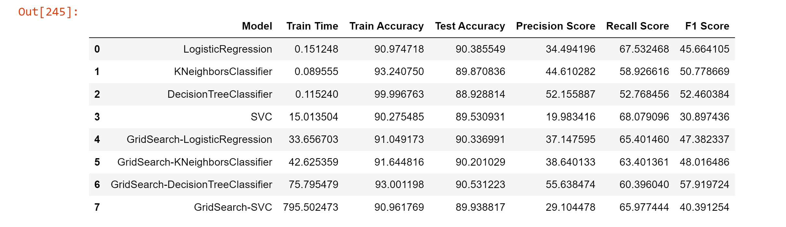

# Practical Application III: Bank-Marketing - Comparing Classifiers

## Overview:

This data study examines a Portugese banking institution dataset from the UCI Machine Learning repository and predict if the client will subscribe a term deposit. The goal is to compare the performance of the classifiers, namely K Nearest Neighbor, Logistic Regression, Decision Trees, and Support Vector Machines. We will utilize a dataset related to marketing bank products over the telephone.

## Description
The business goal is to build a model that can explain success of a contact, i.e. if the client subscribes the deposit. Such model can increase campaign efficiency by identifying the main characteristics that affect success, helping in a better management of the available resources (e.g. human effort, phone calls, time) and selection of a high quality and affordable set of potential buying customers. 

## Getting Started :
To get started with this project, we need to have the following dependecies :
* Python 3.6+
* Jupyter Notebook
* Bank MArketing Dataset
* Python libraries such as NumPy,Pandas,Scikit-learn,matplotlib, seaborn.

##### Taking following steps to understand the data :

Explore the data: Overview of the data, such as the number of records, the number of columns, and the data types of each column and would also look for any patterns or trends in the data.

##### Data Quality Issues :

* Identify any missing values in the data.
* Identify any duplicate records in the data.
* Identify any outliers in the data and investigate them.
* Check for any inconsistencies in data type and format of the data.

##### Data Preparation :
After our initial exploration and fine tuning of the business understanding, it is time to construct our final dataset prior to modeling. Here, we want to make sure to handle any integrity issues and cleaning, the engineering of new features, any transformations that we believe should happen (scaling, logarithms, normalization, etc.), and general preparation for modeling with sklearn.

##### Data Encoding / Scaling:
The following encoding techniques were applied to the categorical variables:

* Ordinal Encoding
* One-Hot Encoding (Panda Dummies)
* min_max_scaler

### Data Visualization :

##### Visualizing Count/Percentage of customers subscribed to campaign

##### Plotting distribution of independent variables

##### Plotting distribution of continuous variables

##### Visualizing data correlation using heatmap.

We can see that duration and previous have positive correlation while nr.employed, euribor3m, pdays and emp.var.rate have negative correlation.

##### Visualizing data correlation to the target variable.

After the data encoding we can see impact of categorical variables to target variable.

### Modeling :

##### Prepare Datasets for Model :

Creating train and test datasets after the data encoding, scaling and feature selection.
Creating function for cross validation/process the result of the model.
Creating dataframe that store the performance of each model for the final review and selection.

`LogisticRegression Model` - Logistic regression model resulted in 90.97% training accuracy, 90.38% test accuracy with 34.49% precision score, 67.53% recall score and 45.66% f1 score.
`KNeighborsClassifier Model` - KNeighborsClassifier model resulted in 93.24% training accuracy, 89.87% test accuracy with 44.61% precision score, 58.92% recall score and 50.77% f1 score.
`DecisionTreeClassifier Model` - DecisionTreeClassifier model resulted in 99.99% training accuracy, 88.92% test accuracy with 52.15% precision score, 52.76% recall score and 52.46% f1 score.
`SVC Model` - SVC model resulted in 90.27% training accuracy, 89.53% test accuracy with 19.98% precision score, 68.07% recall score and 30.89% f1 score.

##### Models with Gridsearch and hyperparamters :

`GridSearch-LogisticRegression Model` - Logistic regression model with gridsearch and hyperparamters resulted in 91.04% training accuracy, 90.33% test accuracy with 37.14% precision score, 65.40% recall score and 47.38% f1 score.
`GridSearch-KNeighborsClassifier Model` - KNeighborsClassifier model with gridsearch and hyperparamters resulted in 91.64% training accuracy, 90.20% test accuracy with 38.64% precision score, 63.40% recall score and 48.01% f1 score.
`GridSearch-DecisionTreeClassifier Model` - DecisionTreeClassifier model with gridsearch and hyperparamters resulted in 93.0% training accuracy, 90.53% test accuracy with 55.63% precision score, 60.39% recall score and 57.91% f1 score.
`GridSearch-SVC Model` - SVC model with gridsearch and hyperparamters resulted in 90.96% training accuracy, 89.93% test accuracy with 29.10% precision score, 65.97% recall score and 40.39% f1 score.

### Evaluation:

Now that we have built some models, we can compare and verify the performance of each model, result of cross validation for each model is added into model_comp for the final review.

As a part of cross validation, each model is evaluated for training time, training accuracy, test accuracy, precision, recall and f1 score.

##### Summary of Model Evaluations :

Logistic Regression achieved highest accuracy with good recall and f1 score and relatively low precision, this makes one of the best choice.

KNeighborsClassifier has overall good accuracy, precision, recall and f1 score, model with gridserach hyperparamater yielded better results than the generic KNeighborsClassifier.

DecisionTreeClassifier achieved the hightest accuracy among all models with better precision, recall and f1 scores, model with gridserach hyperparamater yielded overall better results and making it best choice.

SVC model achieved the good accuracy but very low precision indicating higher chances of false positives and took a much longer training time.

## Next Steps and Recommendations

I recommend to use the DecisionTreeClassifier with hyperparameters as it has demonstrated hightest accuracy among all models with better precision, recall and f1 scores making it suitable for this classification task in predicting client subscription to a term deposit.

#### Feature Exploration: 
Continue exploring and engineering features that could improve model performance.

#### Hyperparameter Refinement: 
Refine hyperparameters while validating against unseen data for optimal generalization. Optimizing hyperparameters can further improve model efficiency.

#### Domain Expertise: 
Use domain knowledge to improve the feature selection and to interpret model results.

#### Address Class Imbalance:
As class imbalance can lead to biased model performance and suboptimal results, consider applying resampling techniques like oversampling of minority class with methods like SMOTE or undersampling of majority class.

#### Evaluation Metrics:

Evaluate the model using additional metrics such as AUC ROC, Precision-Recall Curve, confusion matrix, and weighted averaging to obtain  comprehensive performance evaluation.

# Link to notebook :

https://github.com/ashwinisanagoudar/bank-marketing/blob/main/application-3-bank-marketing.ipynb